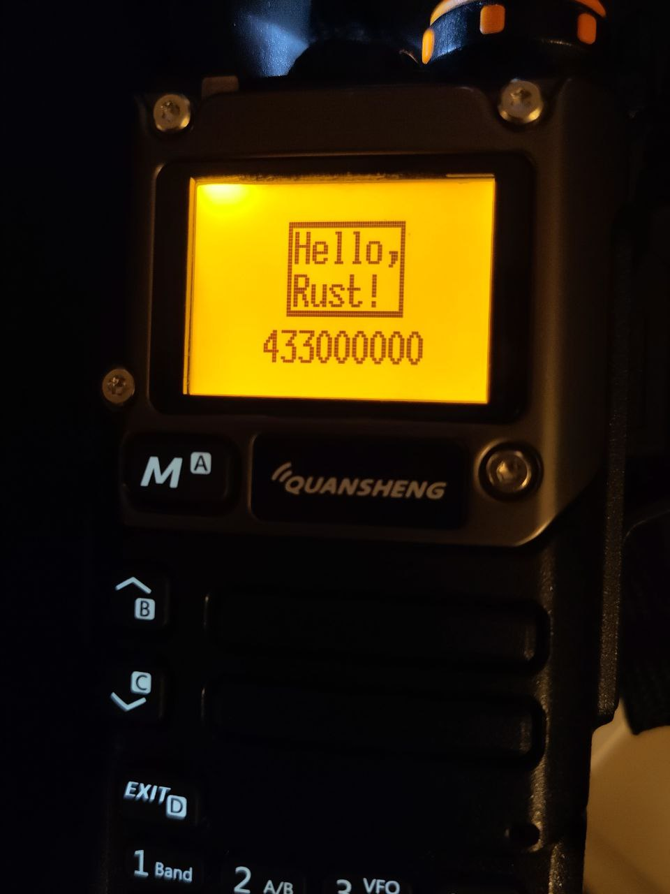

# rQuansheng

This is an highly experimental from-scratch reimplementation for a firmware for the Quansheng UV-K5 (v1) radio, made in Rust

This is not a black box reimplementation, some low-level parts are rewritten from C, some are inspired then refactored, some are original.

All the UI code is original.

# Flashing the firmware

1. `cd` to `cross/rquansheng`
1. put the radio in DFU (PTT + turn on)
1. run the command `cargo run --release`

A k5prog binary is vendored, from this fork: https://github.com/nica-f/k5prog

# PC Software

rQuansheng can run on a normal PC, controlling the radio chip on a physical device through the serial cable

1. flash the rQuansheng firmware
1. CTRL+C at the flasher logcat
1. go to the `host_sw` directory
1. run `RUST_LOG=INFO cargo run --release --bin emulator -- --serial /dev/ttyUSB0`


## bk4819

There are two implementation for driving the bk4819

The old, deprecated c-style interface with constants and bitwise operations, and the new struct-based implementation (`cross/rquansheng/src/bk4819_n.rs`)

For now, a lot of functionality is stubbed in the old way, it's supposed to be rewritten to the new interface

Example of the old interface:
```rust

self.write_register_raw(
    Register_old::Reg4E,
    (1u16 << 14) | (5u16 << 11) | (6u16 << 9) | thresholds.open_glitch as u16,
)?;

```

Example of the new interface:
```rust
self.write_register(
    Reg48::new()
        .with_af_dac_gain(8)
        .with_afrx_gain2(58)
        .with_afrx_gain1(0)
        .with_undocumented(11),
)?;
```


# Roadmap

## Basics
- [x] run a binary
- [x] run RTIC
- [x] gpio driver
- [ ] adc / battery level
- [x] bk4819 bitbang driver
- [x] bk4819 hal and library
- [ ] bk1080 driver
- [x] keyboard driver and events
- [x] display driver
- [x] eeprom driver 
- [ ] bk4819 hal refactoring (partial)

## High level
- [x] fm radio rx
- [x] fm radio tx
- [x] serial protocol for remote control
- [ ] defmt logs wrapped by the serial protocol
- [x] basic UI for radio state
- [ ] basic UI for menu
- [ ] eeprom settings save
- [ ] full support for CTCSS / CDCSS etc etc
- [ ] AM / SSB


## In the far future, probably never
- [ ] spectrum analysis
- [ ] scanning
- [ ] ARDF




# Hardware support

This is developed and works for devices with this label


